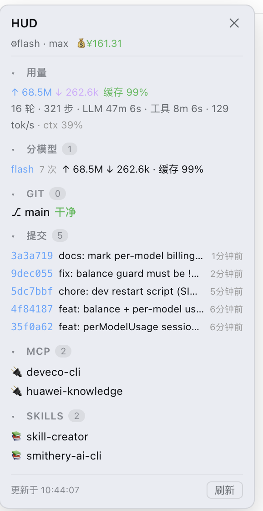

# dsh-hud

[English](README.md) | [简体中文](README.zh-CN.md)


[DeepSeek Harness](https://github.com/deepseek-ai/deepseek-harness)（`dsh`）web 的 **HUD 状态面板**插件。
输入框工具行一键按钮，右侧浮层面板展示：

- **Git** —— 分支、ahead/behind、未暂存 / 已暂存 / 未跟踪文件（分组可折叠）、每文件
  `+N/-N` 摘要、点击文件展开 diff 全文、最近 5 条提交
- **MCP** —— 已挂载的 MCP 服务器（从 `mcp__<服务器>__<工具>` 工具名推导）
- **Skills** —— 当前 agent 可用的技能列表
- **官方信息聚合** —— 当前模型 + reasoning effort、plan 状态、token 用量（输入 / 输出 /
  缓存命中率）、会话统计（轮数、步数、LLM 与工具耗时、解码 tok/s、上下文占用 %）
- **官方余额** —— 自动调 `GET /user/balance`（用 `DEEPSEEK_API_KEY` 凭据，key 不出机器；
  不可用时显示 `--`）
- **分模型用量** —— 本会话按模型的 token 明细（请求数/输入/缓存/输出），切换
  flash/pro 后两个模型的用量都保留显示

按钮还带**未提交文件数角标**，不打开面板也能一眼看出项目有没有待提交改动。

## 截图




右侧浮层面板：Git 状态、提交历史、MCP 服务器、技能列表，以及官方用量信息
（token 输入/输出、缓存命中率、轮数/步数、LLM 与工具耗时、上下文占用）。

## 平台支持

| 平台 | 状态 |
|---|---|
| macOS | ✅ 开发环境，全功能实测 |
| Windows / Linux | ⚠️ 未实测；架构上预期可用，见 [docs/install.md](docs/install.md#平台支持) |

## 环境要求

- DSH web（`npx @deepseek-ai/dsh web` 启动）
- PATH 里有 `git` 命令行
- 不需要额外装 shell：DSH 的 shell 服务在所有平台上都以 `bash -c` 执行（Windows 为
  Git Bash），DSH 能跑，本插件就跟着能跑

## 安装

本仓库是官方 **bundle 插件**格式（根 `package.json` 的 `dsh.bundle` + `dsh.client`），
经官方 profile 管理一行安装：

```sh
dsh plugin --profile web add "github:a903067276-rgb/dsh-hud#main"
```

装完**重启 `dsh web`**（bundle 层在启动时合成，热更新无效）。

> **需要 pnpm**（`dsh plugin` 是 pnpm 转发器）：未安装用 `npm i -g pnpm`，主版本需与
> profile 现有 store 一致。没有 `dsh plugin` 命令的环境可用手动兜底
> （`~/.dsh/cordis.patch.yml` 里文件路径 + 包名双 entry 挂载），见
> [docs/install.md](docs/install.md)。bundle 安装与手动挂载**二选一**，不要同时用。

## 使用

点输入框工具行的仪表盘图标按钮（官方 dsw 风格，跟随深浅色主题）。面板贴右侧展开（默认 240px），拖左边缘把手调整宽度
（200–480px，localStorage 记忆）。带计数徽标的小节标题可点击折叠/展开。数据每 30 秒
自动刷新（面板关闭时只轮询轻量的 git 角标数据）。

## 工作原理

```
┌─ Host（Node，cordis 插件）────────┐      ┌─ 浏览器（client bundle）───┐
│  lib/index.js                     │      │  lib/client.js             │
│                                   │      │                            │
│  webServer.register(/api/dsh-hud) │──fetch──▶  input.left seat：按钮   │
│    ├ /api/dsh-hud   git/mcp/…     │      │  shell.overlay seat：面板   │
│    └ /api/dsh-hud/diff  单文件 diff│      │                            │
└───────────────────────────────────┘      └────────────────────────────┘
```

Host 半经 `webServer` prefix 路由输出 JSON，全部 git 命令合并成**一次 `bash -c`
调用**（`__HUD_[BHSLN]__` 分隔符分段，切项目刷新快）。Client 半是手写的
`window.__ModuleLoader__.load(...)` bundle，零构建步骤；按钮与面板通过模块级 store
（`useSyncExternalStore`）共享状态。维护者请看 [docs/architecture.md](docs/architecture.md)
（含实现细节与踩坑记录）。

## 开发

```
lib/index.js        host 半 —— 数据路由（git / mcp / skills / model）
lib/client.js       client 半 —— UI（按钮 + 面板），最终产物，无构建步骤
cordis.patch.yml    bundle patch —— 单 entry 包名挂载（官方 bundle 流程）
docs/               安装指南与实现说明
examples/           手动双 entry 挂载示例（兜底安装路径）
```

本地测试：软链（或 `dsh plugin --profile web link`）进 web profile 的 node_modules，
加两条挂载 entry，重启 `dsh web`。

## 设计路线（简洁优先）

dsh-hud 刻意保持最小：

- **零依赖** —— 无运行时依赖、无构建步骤，client bundle 就是仓库里的最终产物
- **纯只读** —— 只读 git 状态、MCP/Skills 列表和官方投影，不做任何 git 写操作、不改文件
- **一个按钮一个面板** —— 没有设置页、没有配置文件

**独立社区项目**：非 DeepSeek 官方出品，与任何其他 DSH 插件项目无关联、非衍生、无代码
共享。需要重操作（提交/推送 UI、文件树、git 图谱）的话，社区有其他插件覆盖；dsh-hud
刻意只做"扫一眼就懂"的状态面板，可与它们共存。

## 社区

本插件是 DeepSeek Harness 生态的一部分。更多插件见
[`dsh-plugin` 话题](https://github.com/topics/dsh-plugin)。

## 许可证

[MIT](LICENSE)
